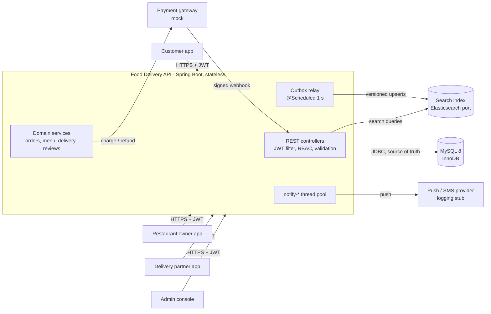
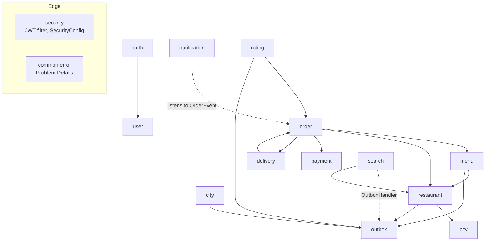
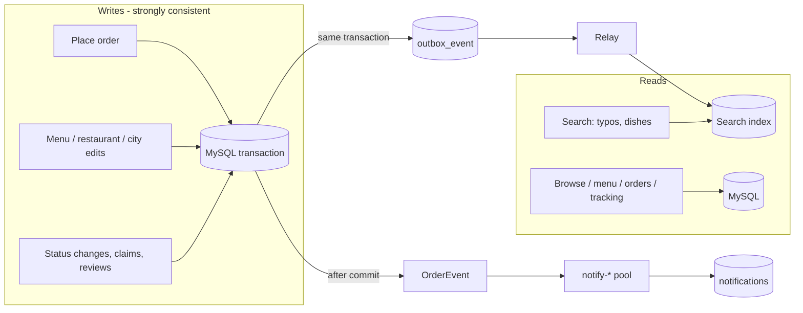
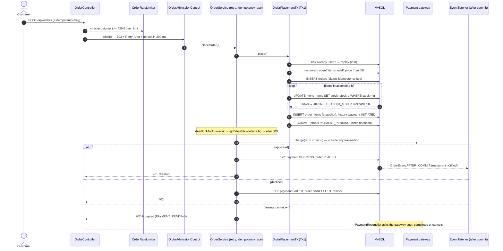
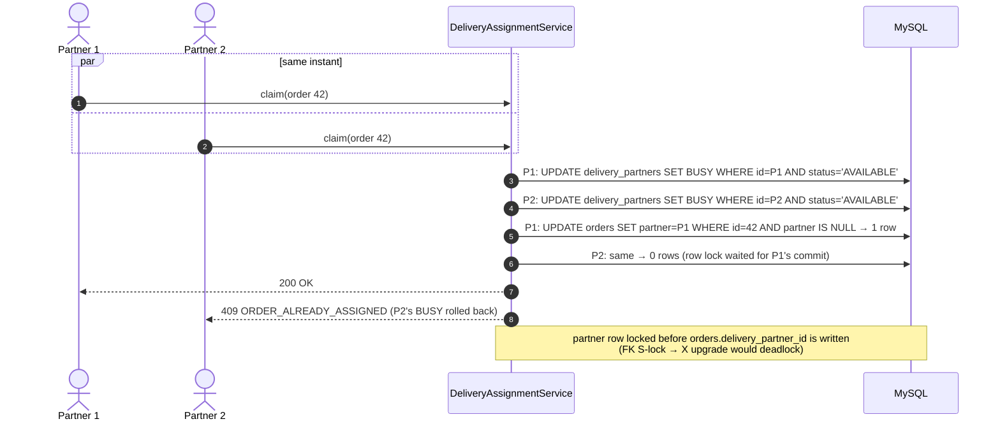
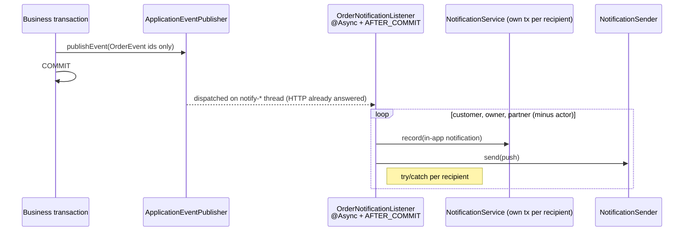
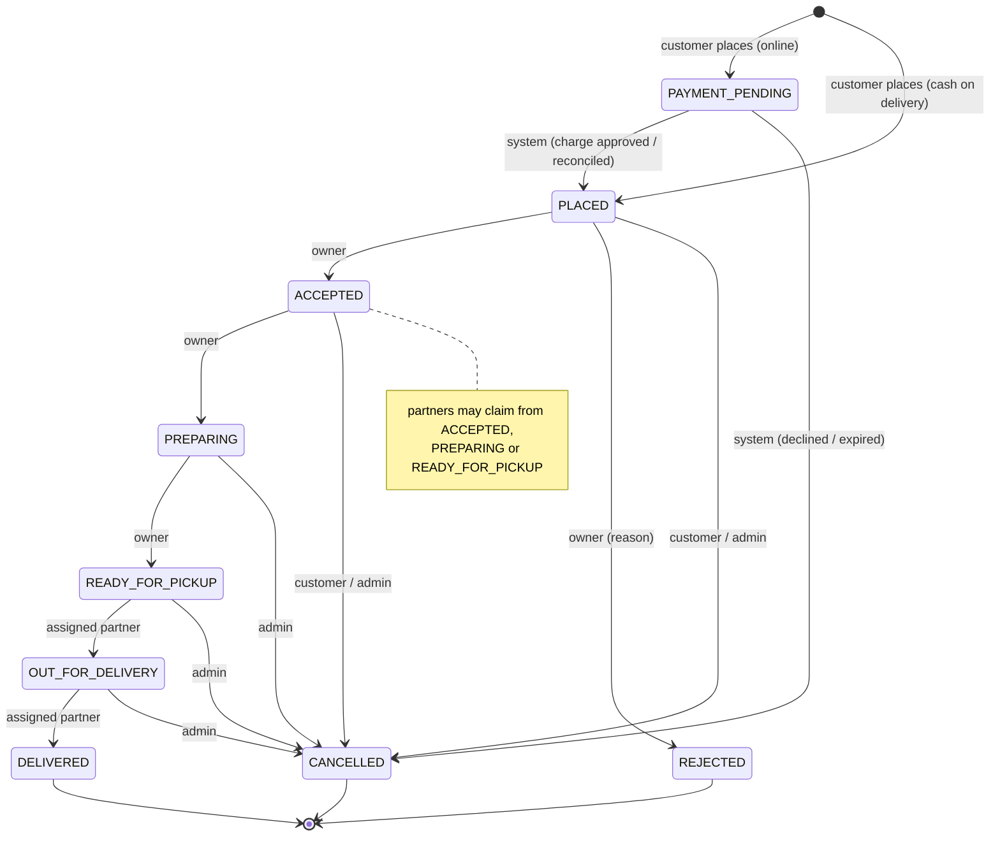
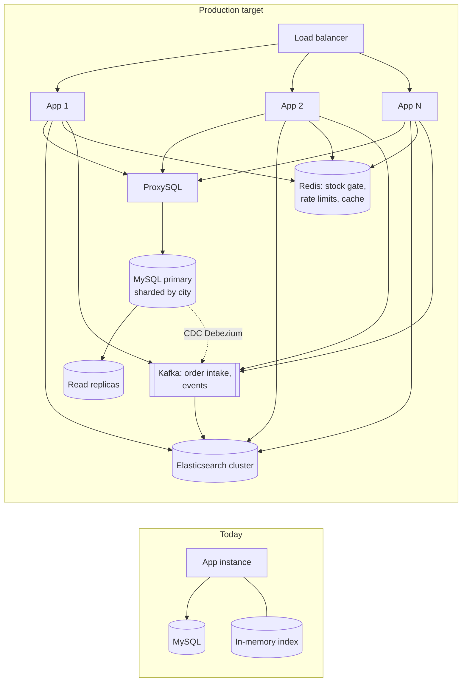

# High-Level Design — Food Delivery Order Management

Scope: a single Spring Boot service (modular monolith) backed by MySQL, with an asynchronous notification
pipeline and a search index kept in sync through a transactional outbox. Distributed infrastructure
(Kafka, Redis, real Elasticsearch) was out of scope; where the design depends on it, a port/adapter or a
documented production path is used (see ADRs in [`docs/decisions`](../decisions)).

## 1. Requirements

**Functional (from the brief):** multi-city restaurants and menus; customers browse, order, track, rate;
restaurant owners manage menus and accept/reject orders; delivery partners claim orders and update
delivery status; admins manage cities, restaurants and partners.

**Hard problems called out by the brief → design answer**

| Requirement | Design answer | ADR |
|---|---|---|
| No overselling under concurrent orders | Single conditional `UPDATE ... WHERE stock >= :q` per item | [0008](../decisions/0008-order-placement.md) |
| Stock + order + payment atomic | Saga: reserve in one short transaction, charge after commit, confirm or compensate; reconciler for unknown outcomes | [0015](../decisions/0015-payment-saga.md) |
| Partners contending for one order | Two compare-and-set updates (partner AVAILABLE→BUSY, order unassigned→partner) | [0010](../decisions/0010-delivery-assignment.md) |
| Status fan-out without blocking | `@TransactionalEventListener(AFTER_COMMIT)` + `@Async` pool | [0011](../decisions/0011-async-notifications.md) |
| Ratings after delivery | Atomic sum/count increments, one review per order | [0012](../decisions/0012-ratings-and-reviews.md) |

**Non-functional:** correctness under concurrency (proven by multi-threaded tests on real MySQL), stateless
horizontal scaling, graceful degradation (search fallback, 503/429 with `Retry-After`), least privilege,
auditability (status history, ADRs).

## 2. System context



## 3. Architecture — modular monolith, package by feature



- Each feature package has controller → service → repository; controllers exchange DTO records only.
- Cross-feature side effects are either direct service calls inside the same transaction (restock,
  refund, partner release) or events (notifications after commit, search via outbox).
- Known mild smell: `order ↔ delivery` depend on each other (claim vs release); an in-transaction domain
  event would decouple them.

## 4. Read vs write paths (CQRS-lite)



- MySQL is the source of truth; the search index is an eventually consistent projection (~1 s).
- Stock is never read from the index: the real-time check happens in the order transaction.

## 5. Key flows

### 5.1 Order placement



### 5.2 Delivery partner claim (contention)



### 5.3 Search index synchronisation (no lost updates)

```mermaid
sequenceDiagram
    autonumber
    participant SVC as Service (e.g. menu edit)
    participant DB as MySQL
    participant R as OutboxRelay (READ COMMITTED)
    participant PJ as SearchProjector
    participant IX as SearchIndex

    SVC->>DB: UPDATE restaurants SET search_version=search_version+1
    SVC->>DB: INSERT outbox_event(RESTAURANT, id)
    SVC->>DB: UPDATE menu_items ... ; COMMIT (all or nothing)
    loop every 1 s
        R->>DB: SELECT due rows FOR UPDATE SKIP LOCKED
        R->>PJ: handle(distinct restaurant ids)  (coalescing)
        PJ->>DB: read CURRENT state + search_version (one snapshot)
        PJ->>IX: upsert(doc, version=search_version) / versioned delete
        alt index unavailable
            R->>DB: attempts+1, next_attempt_at += 2^n s, last_error
        else ok
            R->>DB: processed_at = now
        end
    end
```

### 5.4 Notification fan-out



## 6. Order lifecycle



Side effects: REJECTED/CANCELLED → refund (or void COD), restock only if not yet cooked, release partner;
DELIVERED → COD settled, partner released. Every change → history row + OrderEvent.

## 7. Deployment



The app is stateless (JWT, no sessions) and all concurrency control lives in the database, so adding
instances needs no code change; the limits are DB connections and hot rows (see ADR 0014).

## 8. Cross-cutting concerns

| Concern | Approach |
|---|---|
| Security | Stateless JWT (HS256, 60 min), RBAC via URL rules + `@PreAuthorize`, ownership-scoped queries (404 for others' data), BCrypt, timing-safe login, least-privilege DB user |
| Errors | RFC 9457 Problem Details with stable `code`; 400/401/403/404/409/402/429/503/500 |
| Consistency | Conditional UPDATEs for hot rows, `@Version` for rare conflicts, unique constraints for exactly-once creation, lock-order rules |
| Resilience | Bulkhead + rate limit, fail-fast timeouts, retry outside transactions, search fallback to MySQL, outbox retries with backoff |
| Observability | Structured logs, status history, `/api/admin/search/status`; metrics/tracing out of scope |
| Testing | Unit, web slice, integration on real MySQL, async (Awaitility), concurrency (real server + latch) — 190 tests |
