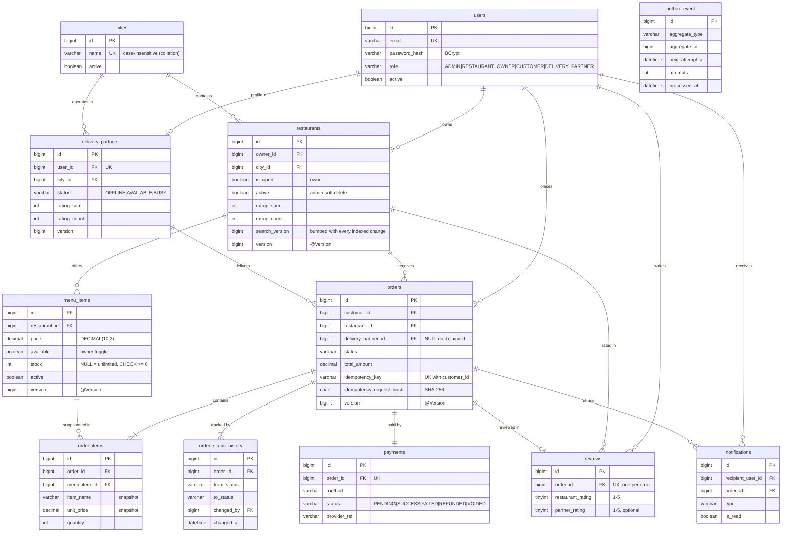
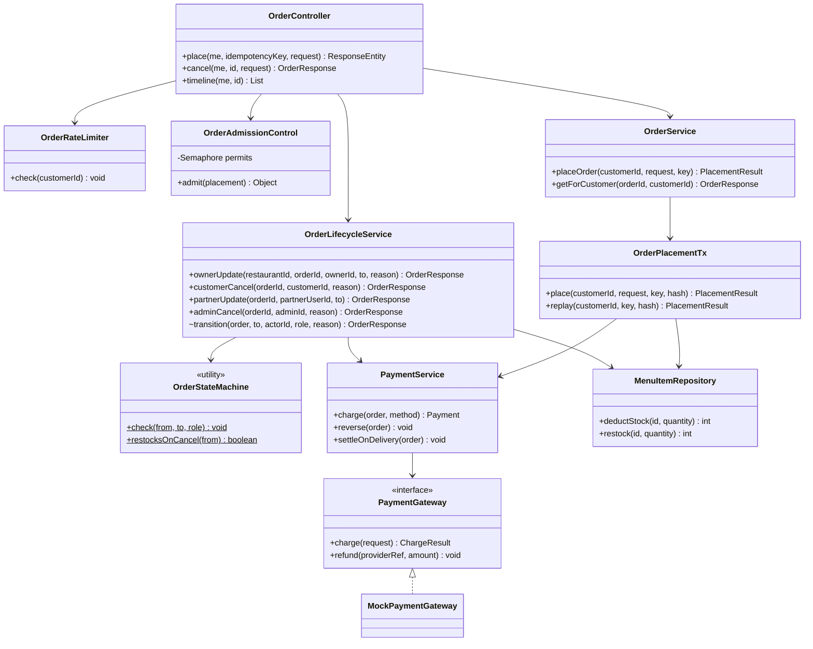
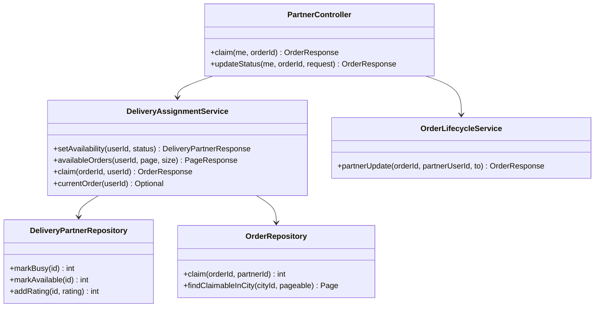
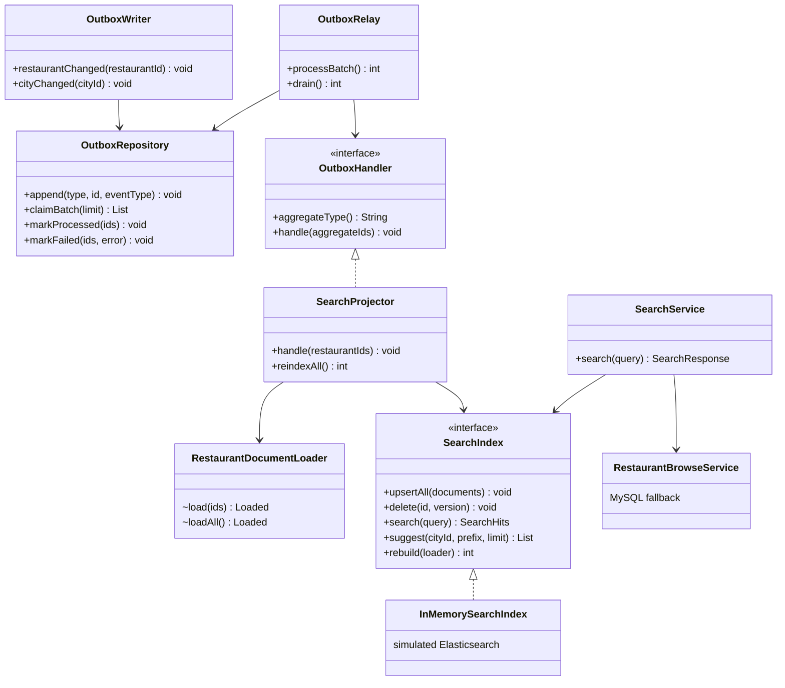
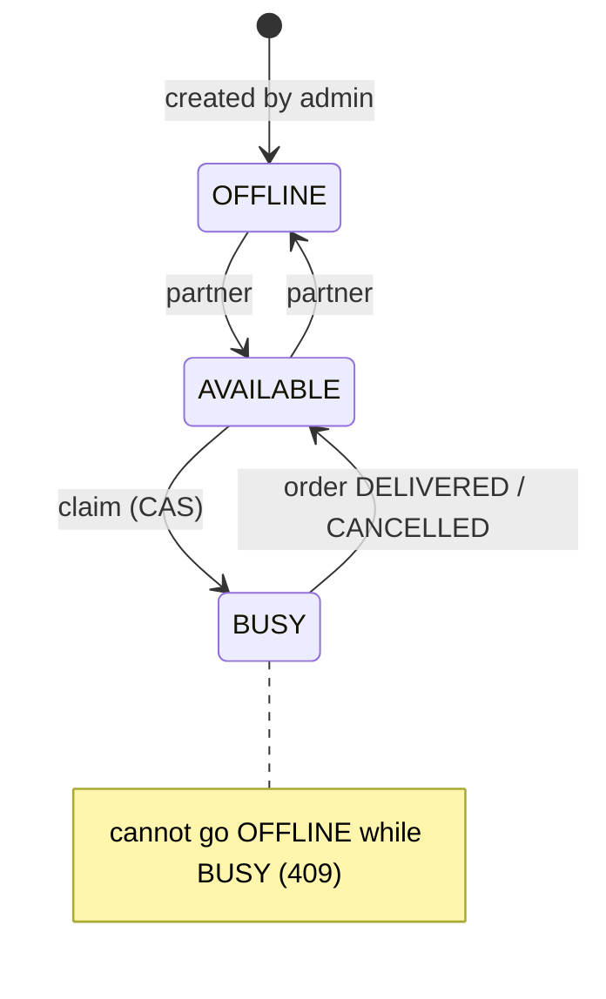
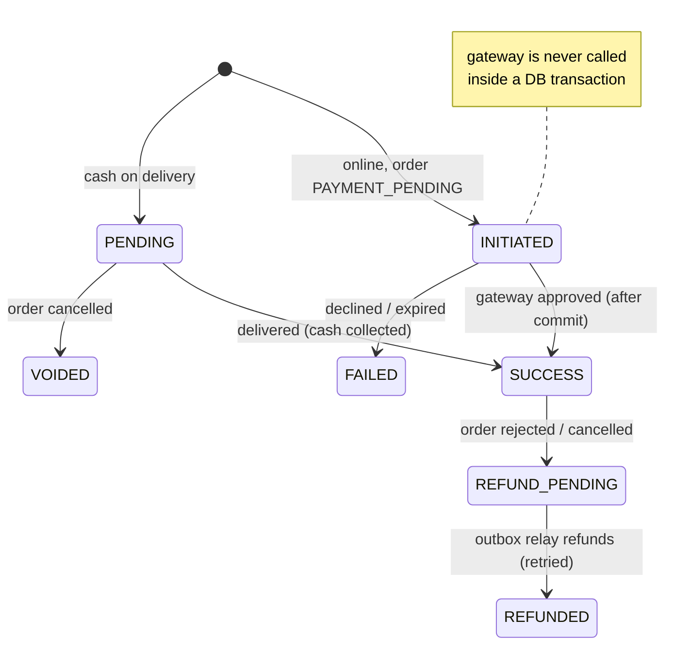

# Low-Level Design — Food Delivery Order Management

Companion to the [HLD](HLD.md). Everything here matches the code (`src/main/java/com/fooddelivery`) and the
Flyway migrations (`src/main/resources/db/migration`, V1–V5).

## 1. Data model (ER)



**Indexes (each backs a query):** `restaurants(city_id, active)` browse · `menu_items(restaurant_id, active)` menu ·
`orders(customer_id, created_at)` my orders · `orders(restaurant_id, status)` kitchen queue ·
`orders(status, delivery_partner_id)` claimable orders · `reviews(restaurant_id, created_at)` public reviews ·
`notifications(recipient_user_id, created_at)` feed · `outbox_event(processed_at, next_attempt_at, id)` relay claim.

## 2. Module class diagrams

### 2.1 Ordering



`OrderService.placeOrder` is `@Retryable` (outside the transaction); `OrderPlacementTx.place` is
`@Transactional`; `PaymentService.charge/reverse` are `Propagation.MANDATORY` (see §5).

### 2.2 Delivery



### 2.3 Search and outbox



`OutboxWriter` methods are `Propagation.MANDATORY`; `claimBatch` uses `FOR UPDATE SKIP LOCKED`;
the relay runs each batch at READ COMMITTED.

### 2.4 Security and error pipeline

```mermaid
flowchart LR
    REQ[HTTP request] --> F[JwtAuthenticationFilter<br/>valid → AuthUser in context<br/>invalid → reason attribute]
    F --> AZ{AuthorizationFilter<br/>URL rules}
    AZ -->|anonymous| EP[ProblemDetailsSecurityHandler<br/>401 + WWW-Authenticate]
    AZ -->|wrong role| DH[ProblemDetailsSecurityHandler<br/>403]
    AZ -->|ok| CTRL[Controller<br/>@PreAuthorize, @Valid]
    CTRL --> SVC[Service<br/>ownership query → 404]
    EP --> HER[HandlerExceptionResolver]
    DH --> HER
    CTRL -. exceptions .-> GEH[GlobalExceptionHandler<br/>RFC 9457 + code]
    HER --> GEH
```

## 3. State machines

### Delivery partner



### Payment



The order state machine is in the [HLD §6](HLD.md#6-order-lifecycle).

## 4. Concurrency control catalogue

| Operation | Contended resource | Technique | Lock order / notes |
|---|---|---|---|
| Place order | `menu_items.stock` | Conditional `UPDATE ... WHERE stock >= :q` | orders row inserted → stock X-locks (ascending item id) → order_items (FK) |
| Idempotent placement | `(customer_id, idempotency_key)` | UNIQUE + replay on duplicate | order row inserted before stock so duplicates never touch stock |
| Status transition | `orders` row | `@Version`, flushed before side effects | loser rolls back incl. restock/refund |
| Restock | `menu_items.stock` | `stock = stock + q` | ascending item id |
| Partner claim | `delivery_partners`, `orders` | Two compare-and-set UPDATEs | partner row → order row (FK S→X rule) |
| Partner release | `delivery_partners` | CAS `BUSY → AVAILABLE` | order row → partner row; no cycle (claims only continue for AVAILABLE partners) |
| Owner stock set | `menu_items` | `@Version` (sales bump version) | 409 on concurrent sale |
| Review | `restaurants/partners` aggregates, `reviews.order_id` | Atomic increments + UNIQUE | increment before inserting the review (FK S→X rule) |
| Search sync | `restaurants.search_version`, `outbox_event` | Bump in business tx; relay `FOR UPDATE SKIP LOCKED` at READ COMMITTED; external versioning in the index | bump before modifying menu items |
| Order spike | DB connections | Semaphore bulkhead + token bucket | 503 / 429 with `Retry-After` |

**Rule learned three times:** X-lock a parent row before writing a child that references it; the FK check
takes a shared lock and concurrent S→X upgrades deadlock (ADR 0008, 0010, 0012).

## 5. Transactions and isolation

| Unit | Boundary | Isolation |
|---|---|---|
| Request services | `@Transactional` on service methods; `open-in-view` off | REPEATABLE READ (InnoDB default); UPDATE = locking read of latest row |
| Placement retry | `OrderService` (no tx) wraps `OrderPlacementTx` | retry must be outside the rolled-back tx |
| Payment / outbox writes | `Propagation.MANDATORY` | must join the business transaction; never call the gateway |
| Payment saga | `OrderCheckoutService` (no tx): Tx1 reserve → gateway → Tx2 confirm/compensate | gateway call holds no locks or connections |
| Notifications | after commit, own tx per recipient on `notify-*` | — |
| Outbox relay | `TransactionTemplate` per batch | READ COMMITTED (no gap-lock deadlocks) |

## 6. API conventions

- Role prefixes: `/api/admin/**`, `/api/owner/**`, `/api/partner/**`; customer `/api/orders/**`;
  public `GET /api/cities|restaurants|search/**`. Full table in the [README](../../README.md#api-overview).
- Requests are records validated with Bean Validation (compact constructors normalise input first).
- Lists return `PageResponse {content, page, size, totalElements, totalPages}`; `size` 1–100; server-side sort.
- Errors are Problem Details with a stable `code`, e.g.
  `{"status":409,"code":"INSUFFICIENT_STOCK","detail":"'Chicken Biryani' is out of stock ...","instance":"/api/orders"}`.

## 7. Configuration

| Property | Default | Purpose |
|---|---|---|
| `app.jwt.expiration-minutes` | 60 | token lifetime |
| `app.order.delivery-fee` / `free-delivery-from` | 40.00 / 500.00 | pricing |
| `app.order.admission.max-concurrent` / `acquire-timeout-ms` | 16 / 200 | bulkhead |
| `app.order.rate-limit.capacity` / `refill-per-minute` | 5 / 5 | per-customer limit |
| `app.review.window-days` | 7 | review window |
| `app.outbox.relay.enabled` / `poll-interval-ms` / `batch-size` | true / 1000 / 100 | search sync |
| `spring.datasource.hikari.connection-timeout` | 2000 | fail fast |
| `innodb_lock_wait_timeout` (session) | 5 s | fail fast on lock waits |
